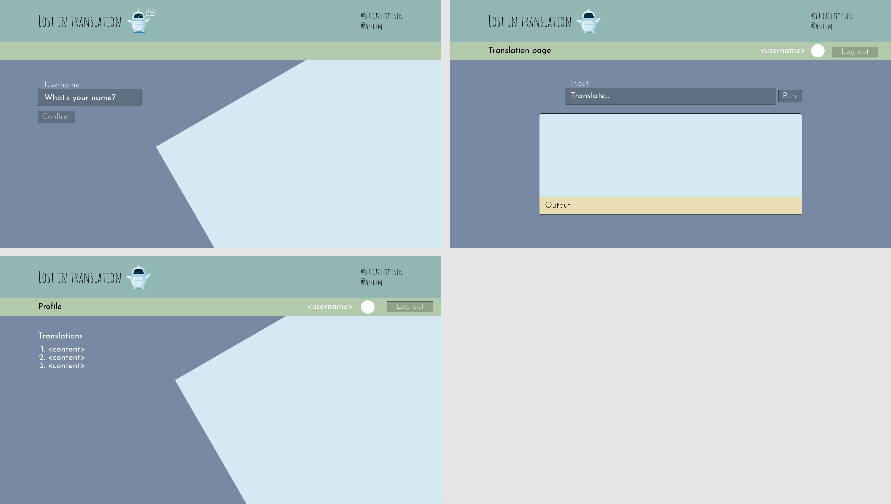

# translation-app

[](https://github.com/RichardLitt/standard-readme)

## Noroff Full Stack Assignment 3 - A React app that translates text to sign language

This project is an iteration of the main assignment in Noroff Fullstack bootcamp's React module.

The user can login, and translate strings into sign language gestures. 

User and the translations are saved into API, Redux store and browser's local storage.

Local storage is used to handle the user session, which enables the user to continue the session even after closing the app. 

Logging out clears local storage and Redux store items.

All of the information can still be retrieved from the API for further use.

## Table of Contents

- [Install](#install)
- [Usage](#usage)
- [UI Concept](#ui-concept)
- [Maintainers](#maintainers)
- [Contributing](#contributing)
- [License](#license)

## Install

For local installation:

Clone the repository for any directory

```
git clone https://github.com/JuliusHuttunen/TranslationApp.git
cd TranslationApp
npm install
```

## Usage

The app is deployed at [Heroku.](https://react-lost-in-translation-app.herokuapp.com/)

Local installation:

In app root directory

```
npm start
```

## UI Concept



## Maintainers

[@JuliusHuttunen](https://github.com/JuliusHuttunen)
[@Azruim (Nico Behnen)](https://github.com/Azruim)

## Contributing

[@JuliusHuttunen](https://github.com/JuliusHuttunen)
[@Azruim (Nico Behnen)](https://github.com/Azruim)

Small note: If editing the README, please conform to the [standard-readme](https://github.com/RichardLitt/standard-readme) specification.

## License

MIT © 2022 Julius Huttunen, Nico Behnen
